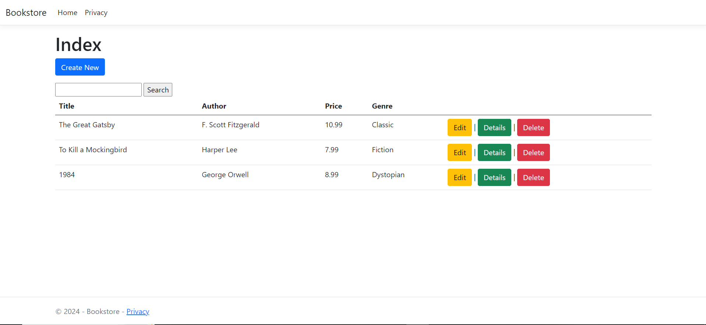

# Bookstore Management Platform

## Overview

This is a Bookstore Management platform built using ASP.NET Core MVC architecture. It includes CRUD operations for managing books using Entity Framework Core and SQL Server for database storage. The application supports search functionality to filter books by title or author.

## Features

- **Create, Read, Update, Delete (CRUD)**: Manage books through a simple user interface.
- **Search**: Filter books by title or author on the index page.
- **Validation**: Form validation for book creation and editing.

## Screenshot


## Prerequisites

Before you can run the project, ensure you have the following installed:

- .NET SDK (6.0 or later) - [Download here](https://dotnet.microsoft.com/download/dotnet)
- Visual Studio 2022 or later (or any compatible IDE) with the ASP.NET and web development workload installed
- SQL Server (LocalDB or another instance) for the database

### Getting Started

1. **Clone the Repository**
   
   ```bash
   git clone https://github.com/yourusername/bookstore.git
   cd bookstore


2. **Restore NuGet Packages**

Navigate to the project directory and restore the required packages using the following command:

  ```bash
   dotnet restore
```

3. **Update the Database**

The project uses Entity Framework Core for database management. Before running the application, apply the migrations to set up the database schema.

First, make sure the connection string in `appsettings.json` is correct for your SQL Server instance:

```json
"ConnectionStrings": {
  "DefaultConnection": "Server=(localdb)\\mssqllocaldb;Database=BookstoreDB;Trusted_Connection=True;MultipleActiveResultSets=true"
}
```

Then, apply the migrations:
  ```bash
   dotnet ef database update
```

4. **Run the Application**

You can run the application using Visual Studio or the command line:
  ```bash
   dotnet run
```

---

# CRUD Functionality

The Bookstore MVC project allows you to perform the following operations:

- **Create**: Add a new book to the store by navigating to the "Add New Book" page and filling in the form.
- **Read**: View a list of all books or details of a specific book on the "Books" page.
- **Update**: Edit book information by selecting a book and clicking on the "Edit" button.
- **Delete**: Remove a book from the database by clicking the "Delete" button.

---

### Testing the Application

1. **Run the Application**: Start the application by pressing `F5` in Visual Studio. This will open the default web browser with the application running.

2. **Navigate Through Pages**:
   - Open the `/Books` path to view the list of books.
   - Use the "Create New" button to add a new book.
   - Click on the "Edit" link for any book to update its details.
   - Use the "Delete" link to remove a book.
   - Click on the "Details" link to view more information about a book.

3. **Test Validation**:
   - Try creating a book without filling in required fields.
   - Ensure validation messages are displayed appropriately.

4. **Search Functionality**:
   - Use the search box on the Index page to filter books by title or author.


